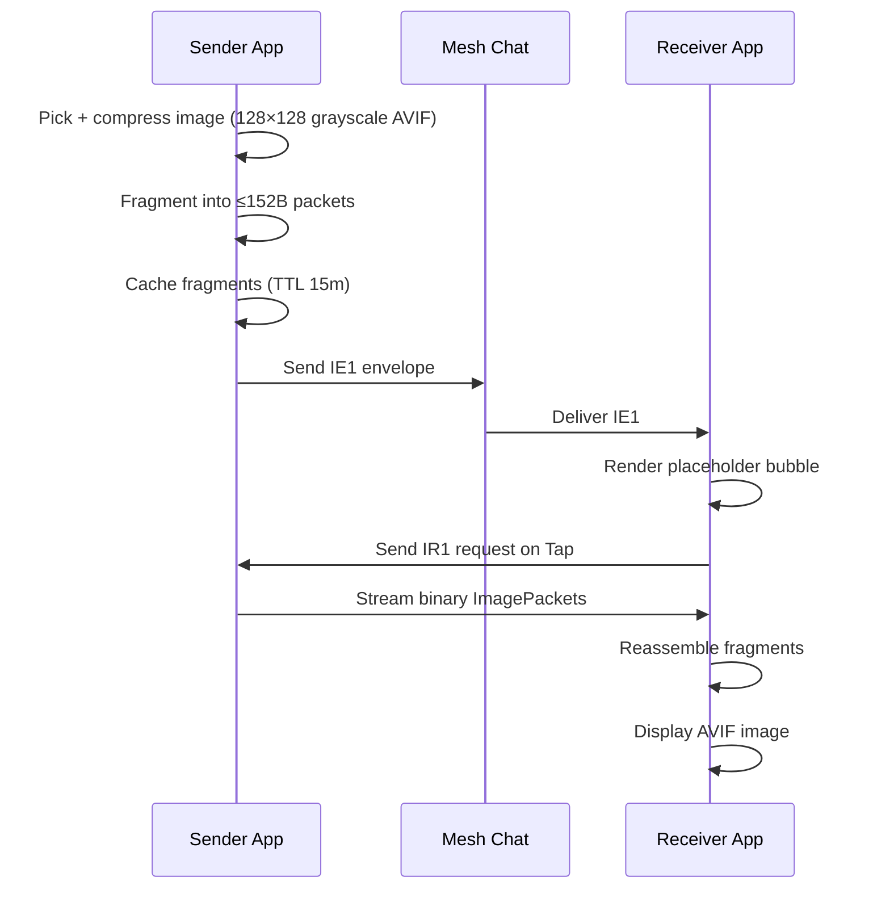

# Image Mode Technical Design

## 1. Overview

Image mode mirrors the voice on-demand architecture exactly:

- **Control plane (text messages):**
  - `IE1:` image envelope announces image availability in chat.
  - `IR1:` direct fetch request asks sender to stream image fragments.
- **Data plane (raw binary packets):**
  - `ImagePacket` binary payload streamed via `cmdSendRawData` / `pushRawData`.

Images are never broadcast in full to channels.  Chat carries only metadata;
pixels are fetched on demand when the user taps the image bubble.

## 2. Key Modules

- `lib/utils/image_message_parser.dart`
  - `ImagePacket` (binary fragment format)
  - `ImageEnvelope` (`IE1`)
  - `ImageFetchRequest` (`IR1`)
  - `fragmentImage()` — split compressed bytes into packets
  - `reassembleImage()` — join received fragments into bytes
- `lib/screens/messages_tab.dart`
  - Pick image, compress to 128×128 grayscale AVIF, cache, send envelope
- `lib/providers/image_provider.dart`
  - Reassembly sessions, outgoing cache, deferred serving
- `lib/providers/app_provider.dart`
  - Incoming routing for `IE1`, `IR1`, binary `0x49` packets
- `lib/widgets/messages/image_message_bubble.dart`
  - Placeholder with tap-to-load; progress ring during fetch; full image view
- `lib/services/image_codec_service.dart`
  - `ImageCodecService.compress()` — `dart:ui` resize + grayscale + AVIF encode

## 3. Wire Formats

### 3.1 Image Envelope (`IE1`)

Prefix: `IE1:` + colon-delimited payload

Fields:

| Field       | Type   | Description                              |
|-------------|--------|------------------------------------------|
| `sid`       | string | 8 hex chars (4 bytes), session ID        |
| `fmt`       | int    | `ImageFormat.id` (0 = AVIF, 1 = JPEG)   |
| `total`     | int    | Fragment count (1..255)                  |
| `w`         | int    | Image width (pixels)                     |
| `h`         | int    | Image height (pixels)                    |
| `bytes`     | int    | Total compressed size in bytes           |
| `senderKey6`| string | 12 hex chars (6 bytes sender prefix)     |
| `ts`        | int    | Unix timestamp (seconds)                 |
| `ver`       | int    | Protocol version (currently `1`)         |

Compact format:

```text
IE1:{sid}:{fmt}:{total}:{w}:{h}:{bytes}:{senderKey6}:{ts}:{ver}
```

Example:

```text
IE1:deadbeef:0:7:128:128:1050:aabbccddeeff:1700000000:1
```

### 3.2 Image Fetch Request (`IR1`)

Same structure as `VR1`:

```text
IR1:{sid}:{want}:{requesterKey6}:{ts}:{ver}
```

| Field          | Value  |
|----------------|--------|
| `want`         | `a` (= "all fragments") |
| `requesterKey6`| 12 hex chars |
| `ver`          | `1`    |

### 3.3 Raw Image Packet (data plane)

Binary payload structure:

- Byte 0: magic `0x49` (`'I'`)
- Bytes 1..4: session ID (4 bytes)
- Byte 5: format ID
- Byte 6: fragment index (0-based)
- Byte 7: total fragments
- Bytes 8..N: image data (max 152 bytes per fragment)

Header is 8 bytes — identical layout to `VoicePacket`.

## 4. Compression Pipeline

1. Source image (any format) is decoded via `dart:ui.instantiateImageCodec`
   with `targetWidth: 128, targetHeight: 128`.
2. RGBA pixels exported via `image.toByteData(format: rawRgba)`.
3. Converted to grayscale (luminance `0.299R + 0.587G + 0.114B`) in-place.
4. Encoded to AVIF via `flutter_avif.encodeAvif()` with:
   - `quality: 60` (CQ scale — lower = better quality)
   - `speed: 8` (fast encode)
5. Fragmented at 152 bytes per packet.

### Expected sizes (128×128 grayscale AVIF)

| Quality | Approx size | Fragments |
|---------|-------------|-----------|
| 40      | 400–800 B   | 3–6       |
| 60      | 600–1400 B  | 4–10      |
| 80      | 1000–2500 B | 7–17      |

Quality 60 targets 4–9 fragments — comparable to a 10-second voice session.

## 5. Outgoing Flow (Send)

1. User picks image from gallery or camera (`image_picker`).
2. `ImageCodecService.compress()` produces small grayscale AVIF bytes.
3. `fragmentImage()` splits bytes into `ImagePacket` list (≤255 fragments).
4. Fragments cached in `ImageProvider` (TTL 15 min).
5. `ImageEnvelope` is sent via normal message path:
   - Channel: `sendChannelMessage`
   - Direct: `sendTextMessage`
6. Local placeholder message added with `IE1:` text and `deliveryStatus.sending`.

## 6. Incoming Flow (Receive)

### 6.1 `IE1` envelope received

`AppProvider` calls `imageProvider.registerEnvelope()` and adds the message to chat.  The bubble shows a grey placeholder with a download icon.

### 6.2 `IR1` request received

`AppProvider` treats it as control-plane only (not added to chat):

- Validates requester key prefix matches sender metadata.
- Resolves requester contact.
- Calls `imageProvider.serveSessionTo()` which streams all fragments.

### 6.3 Raw packet received (`pushRawData`, magic `0x49`)

`AppProvider.onRawDataReceived` parses `ImagePacket` binary and calls
`imageProvider.addFragment()`.  When the session becomes complete, the bubble
automatically rebuilds with the full image.

## 7. Outgoing Cache Details

`ImageProvider` outgoing cache:

- key: `sessionId`
- value: encoded fragment list + cached envelope + timestamp
- TTL: 15 minutes
- eviction: lazy on access

## 8. Display

`ImageMessageBubble`:

- **Complete session**: 128×128 `AvifImage.memory()` widget; tap → full-screen `InteractiveViewer`.
- **Incomplete/missing**: grey placeholder with download icon; tap → sends IR1.
- **Loading**: circular progress with `received/total` count.
- **Error**: "Image unavailable right now" text.

## 9. Persistence

`ImageProvider` stores sessions in `SharedPreferences` under key
`stored_image_sessions_v1`:

- Incoming: fragment list serialized as base64 binary packets.
- Outgoing: fragment list + envelope text + `cachedAt` timestamp.
- Expired outgoing sessions (> 15 min) are not restored.

## 10. Operational Constraints

- No firmware changes required (reuses `cmdSendRawData` / `pushRawData`).
- On-demand fetch works only if sender app is online and has cached session.
- Raw return path requires a valid direct route to requester.
- Image compression uses `flutter_avif` — the `encodeAvif()` top-level
  function must be available (verify against installed package version).

## 11. High-Level Sequence


