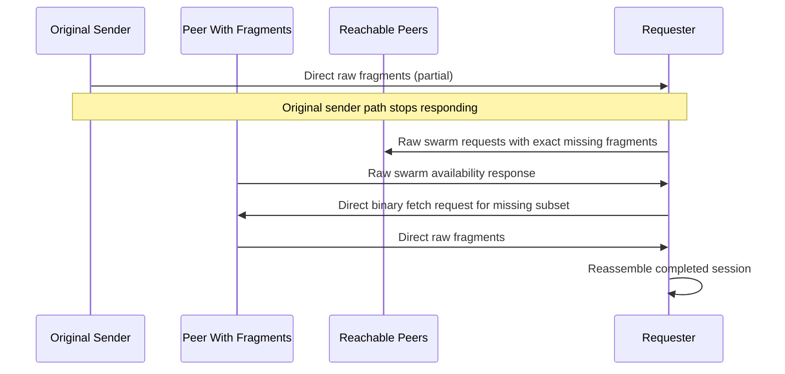

# Swarm Mode Technical Design

## 1. Overview

Swarm mode is a shared media-recovery transport used by both voice and image
sessions when the original sender path stops responding after some fragments
have already propagated through the mesh.

It adds a lightweight **swarm discovery plane** on top of the existing
**direct raw-data transfer plane**:

- **Discovery plane (raw custom control payloads):**
  - `MediaSwarmRequest`
  - `MediaSwarmAvailability`
- **Transfer plane (direct raw binary):**
  - existing `VoiceFetchRequest` / `ImageFetchRequest`
  - existing `VoicePacket` / `ImagePacket`

Swarm mode does not broadcast media payloads. It fans out raw control requests
to reachable peers, collects raw availability responses, and then fetches media
from the best responder.

## 2. Problem It Solves

Without swarm mode, media fetch is limited to the original sender's direct raw
path. If that sender goes offline, moves, or stops responding, a receiver can
be left with a partial session even when other peers already hold useful
fragments.

Swarm mode lets the receiver discover alternate peers and fetch the missing
subset directly from them.

## 3. Control Messages

### 3.1 Media Swarm Request (binary)

```text
[magic=0x6d][kind=0x01][mediaType:1B][sessionId:4B][requesterKey6:6B][missingCount:1B][missingIndices...]
```

Fields:

- `mediaType` — `voice` or `image`
- `sessionId` — 8 hex chars
- `requesterKey6` — 12 hex chars identifying the requesting device
- `missingCount` — `0` means the requester needs all fragments
- `missingIndices` — exact missing fragment indices when `missingCount > 0`

Example:

```text
6d 01 02 de ad be ef aa bb cc dd ee ff 03 00 02 09
```

### 3.2 Media Swarm Availability (binary)

```text
[magic=0x6d][kind=0x02][mediaType:1B][sessionId:4B][requesterKey6:6B][responderKey6:6B][availableCount:1B][availableIndices...]
```

Fields:

- `mediaType` — `voice` or `image`
- `sessionId` — 8 hex chars
- `requesterKey6` — copied from the swarm request
- `responderKey6` — 12 hex chars identifying the responding peer
- `availableCount` — `0` means the responder can satisfy the full request
- `availableIndices` — exact fragment indices held when `availableCount > 0`

Example:

```text
6d 02 02 de ad be ef aa bb cc dd ee ff 11 22 33 44 55 66 02 02 09
```

## 4. Requester Behavior

When a voice or image session is incomplete:

1. Prefer the original sender if its direct raw route is healthy.
2. If the original sender path is unavailable or not responding, send a raw
   swarm request to reachable peers with the exact missing fragment indices.
3. Wait up to **10 seconds** for raw availability responses.
4. Rank responders by overlap with the current missing set.
5. Skip the original sender when choosing alternate peers.
6. Send a direct binary fetch request to the best responder for only the
   missing subset that responder advertised.

Actual media transfer uses the same `cmdSendRawData` / `pushRawData` path as the
swarm control messages.

## 5. Responder Behavior

A peer that receives a swarm request:

- checks whether it has fragments for the requested media session
- replies only if it has at least one requested fragment
- advertises only fragments it actually holds
- may reply from:
  - its outgoing cache, or
  - a partially/fully received incoming session

This enables torrent-like relay behavior without requiring the peer to be the
original sender.

## 6. Visibility and Routing

- Swarm control payloads are carried by `cmdSendRawData` and received through
  `pushRawData`.
- They are intercepted by the app and **must not be surfaced in chat**.
- Discovery is a direct raw fan-out to reachable peers, not a public-channel
  broadcast.
- Media packets themselves remain direct-route raw packets.

## 7. Constraints

- No firmware changes are required.
- Swarm mode only helps if at least one peer has already received some useful
  fragments.
- Peers can only relay fragments they actually have.
- Alternate peers still need a valid direct raw route back to the requester.
- Swarm mode improves recovery from sender-path failure, but it does not change
  the underlying raw-packet size, airtime, or hop constraints.

## 8. High-Level Sequence



## 9. Integration Points

- Voice-specific behavior is summarized in `docs/voice-mode-technical.md`.
- Image-specific behavior is summarized in `docs/image-mode-technical.md`.
- This document is the shared source of truth for swarm discovery and fallback
  semantics.
