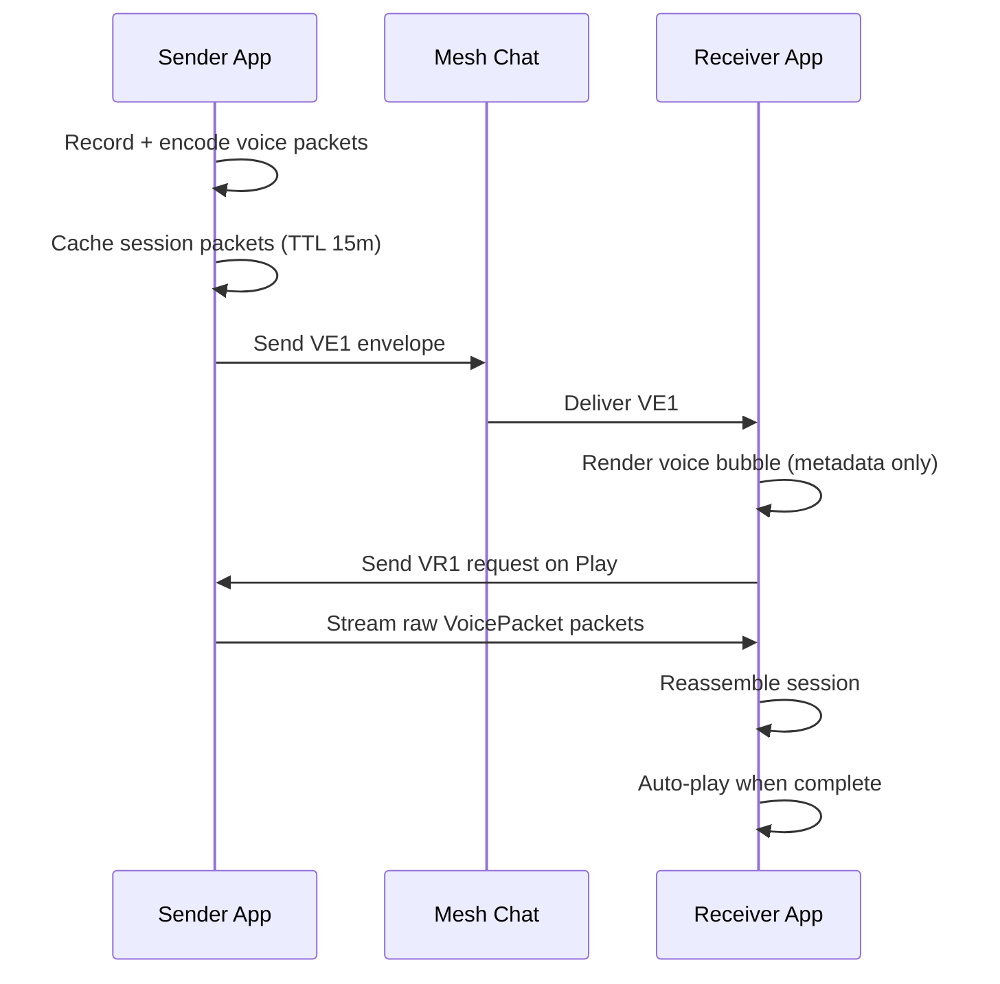

# Voice Mode Technical Design

## 1. Overview

Voice mode uses a **two-plane architecture**:

- **Control plane (text messages):**
  - `VE1:` voice envelope announces voice availability in chat.
  - `VR1:` direct fetch request asks sender to stream voice payload.
- **Data plane (raw binary packets):**
  - `VoicePacket` payload streamed via `cmdSendRawData` and received through `pushRawData`.

This design avoids broadcasting full voice payloads to channels/rooms. Chat carries only metadata; audio is fetched on demand when user presses play.

## 2. Key Modules

- `lib/utils/voice_message_parser.dart`
  - `VoicePacket` (legacy text + binary packet format)
  - `VoiceEnvelope` (`VE1`)
  - `VoiceFetchRequest` (`VR1`)
- `lib/screens/messages_tab.dart`
  - Capture/encode voice, cache encoded packets, send envelope only
- `lib/providers/voice_provider.dart`
  - Reassembly/playback sessions
  - Outgoing session cache + deferred serving
- `lib/providers/app_provider.dart`
  - Incoming routing for `VE1` and `VR1`
  - Handles raw packet ingestion
- `lib/widgets/messages/voice_message_bubble.dart`
  - Play behavior (immediate play if complete, otherwise fetch + auto-play)
- `lib/providers/messages_provider.dart`
  - Message-level voice detection (`VE1` + legacy `V:`)
- `lib/services/message_storage_service.dart`
  - Persists `isVoice` and `voiceId`

## 3. Wire Formats

### 3.1 Voice Envelope (`VE1`)

Prefix: `VE1:` + colon-delimited compact payload

Fields:

- `sid` (string, 8 hex chars): session ID
- `mode` (int): codec mode ID (`VoicePacketMode.id`)
- `total` (int): packet count (1..255)
- `durMs` (int): estimated duration in ms
- `senderKey6` (string, 12 hex chars): sender public-key prefix (6 bytes)
- `ts` (int): unix timestamp seconds
- `ver` (int): protocol version (currently `1`)

Compact format:

```text
VE1:{sid}:{mode}:{total}:{durMs}:{senderKey6}:{ts}:{ver}
```

Example:

```text
VE1:deadbeef:1:4:3200:aabbccddeeff:1700000000:1
```

### 3.2 Voice Fetch Request (`VR1`)

Prefix: `VR1:` + colon-delimited compact payload

Fields:

- `sid` (string, 8 hex chars): requested session
- `want` (string): currently `a` (compact token for `all`)
- `requesterKey6` (string, 12 hex chars): requester key prefix
- `ts` (int): unix timestamp seconds
- `ver` (int): protocol version (`1`)

Compact format:

```text
VR1:{sid}:{want}:{requesterKey6}:{ts}:{ver}
```

Example:

```text
VR1:deadbeef:a:112233445566:1700000010:1
```

### 3.3 Raw Voice Packet (data plane)

Binary payload structure:

- Byte 0: magic `0x56` (`'V'`)
- Bytes 1..4: session ID (4 bytes)
- Byte 5: mode ID
- Byte 6: packet index
- Byte 7: total packets
- Bytes 8..N: codec2 data

## 4. Outgoing Flow (Send)

1. Recorder captures PCM chunks.
2. Each chunk is codec2-encoded into `VoicePacket` objects.
3. Packets are cached in `VoiceProvider` outgoing cache (TTL 15 min).
4. Sender inserts local voice placeholder message (`isVoice=true`, `voiceId=sessionId`).
5. Sender sends one envelope (`VE1`) through normal message path:
   - channel/room: `sendChannelMessage`
   - direct: `sendTextMessage`
6. **No raw audio packets are sent during initial send.**

## 5. Incoming Routing

### 5.1 `VE1` envelope received

`AppProvider` marks message as voice (`isVoice`, `voiceId`) and adds it to chat.

### 5.2 `VR1` request received

`AppProvider` treats it as control-plane only:

- request is not added to chat
- validates requester prefix match against sender metadata
- resolves requester contact via key prefix
- calls `voiceProvider.serveSessionTo(...)`

### 5.3 Raw packet received (`pushRawData`)

`AppProvider.onRawDataReceived` parses `VoicePacket` binary and appends to session in `VoiceProvider`.

## 6. Play / Fetch Behavior

In `VoiceMessageBubble`:

- If session already complete: play immediately.
- If incomplete/missing:
  1. Resolve sender contact (message sender prefix or `VE1.senderKey6` fallback)
  2. Send direct `VR1` fetch request
  3. Show requesting state in UI
  4. Auto-play when session becomes complete

If sender cannot be resolved or request cannot be sent, bubble remains and shows: **"Voice unavailable right now"**.

## 7. Outgoing Cache Details

`VoiceProvider` outgoing cache:

- key: `sessionId`
- value: encoded packet list + cached timestamp
- TTL: 15 minutes (`_outgoingSessionTtl`)
- eviction: lazy (on cache access/add/serve)

Serving prerequisites:

- session exists in cache
- `sendRawPacketCallback` configured
- requester has direct path (`outPathLen >= 0`)

## 8. Persistence

`MessageStorageService` now stores and restores:

- `isVoice`
- `voiceId`

This ensures envelope messages remain voice bubbles across app restart.

## 9. Validation and Safety

Parser validation enforces:

- strict hex lengths for IDs and key prefixes
- valid mode range
- valid packet counts and duration bounds
- fixed protocol version (`ver == 1`)
- `VR1.want` token `a` (internally normalized to `all`)

`VR1` handling verifies sender prefix matches `requesterKey6` to reduce spoofing risk.

## 10. Operational Constraints

- No firmware changes required.
- On-demand fetch works only if sender app is online and has cached session.
- Raw return path needs a currently valid direct route to requester.
- Voice capture is available on iOS and Android (`Platform.isIOS || Platform.isAndroid`).

## 11. Backward Compatibility

- Legacy `V:` text packet parsing is still supported.
- Message voice detection accepts both new `VE1` and legacy `V:` formats.

## 12. High-Level Sequence


