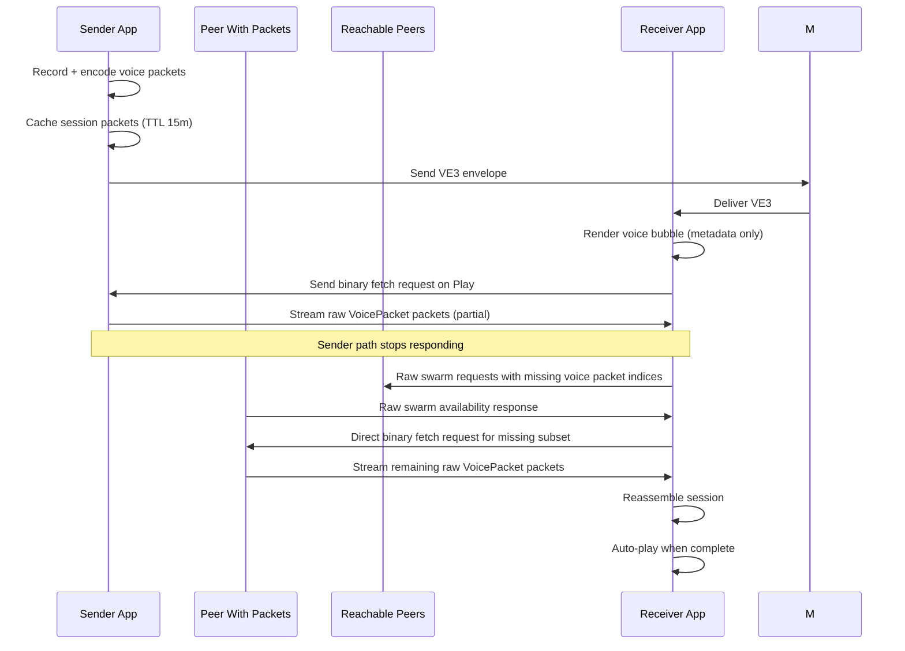

# Voice Mode Technical Design

## 1. Overview

Voice mode uses a **two-plane architecture** with optional swarm-assisted
recovery:

- **Control plane (text messages):**
  - `VE3:` voice envelope announces voice availability in chat.
- **Control plane (raw binary request):**
  - Binary voice fetch request (same raw route as voice packets).
- **Data plane (raw binary packets):**
  - `VoicePacket` payload streamed via `cmdSendRawData` and received through `pushRawData`.

This design avoids broadcasting full voice payloads to channels/rooms. Chat carries only metadata; audio is fetched on demand when user presses play.

Swarm fallback is documented in [Swarm Mode Technical Design](./swarm-mode-technical.md).

## 2. Key Modules

- `lib/utils/voice_message_parser.dart`
  - `VoicePacket` (binary direct-packet format)
  - `VoiceEnvelope` (`VE3`)
  - `VoiceFetchRequest` (binary)
- `lib/screens/messages_tab.dart`
  - Capture/encode voice, cache encoded packets, send envelope only
- `lib/providers/voice_provider.dart`
  - Reassembly/playback sessions
  - Outgoing session cache + deferred serving
- `lib/providers/app_provider.dart`
  - Incoming routing for `VE3`, binary voice fetch requests, and raw swarm control payloads
  - Handles raw packet ingestion
- `lib/widgets/messages/voice_message_bubble.dart`
  - Play behavior (immediate play if complete, otherwise fetch + auto-play)
- `lib/providers/messages_provider.dart`
  - Message-level voice detection (`VE3`)
- `lib/services/message_storage_service.dart`
  - Persists `isVoice` and `voiceId`

## 3. Wire Formats

### 3.1 Voice Envelope (`VE3`)

Prefix: `VE3:` + colon-delimited compact payload (base36 numeric fields)

Fields:

- `sid` (string): base36 token for 32-bit session ID
- `mode` (base36): codec mode ID (`VoicePacketMode.id`)
- `total` (base36): packet count (1..255)
- `durS` (base36): estimated duration in seconds

`sid` is base36 on wire and expands to 8-hex internally.

Compact format:

```text
VE3:{sid}:{mode}:{total}:{durS}
```

Example:

```text
VE3:a:1:4:4
```

### 3.2 Voice Fetch Request (binary)

Binary payload format:

```text
[magic=0x72][sid:4B][flags:1B][requesterKey6:6B][missingCount:1B][missingIndices...]
```

### 3.3 Raw Voice Packet (data plane)

Binary payload structure:

- Byte 0: magic `0x56` (`'V'`)
- Bytes 1..4: session ID (4 bytes)
- Byte 5: packet index
- Bytes 6..N: codec2 data

Header is 6 bytes. Mode and total packet count come from the `VE3` envelope.

## 4. Outgoing Flow (Send)

1. Recorder captures PCM chunks.
2. Each chunk is codec2-encoded into `VoicePacket` objects.
3. Packets are cached in `VoiceProvider` outgoing cache (TTL 15 min).
4. Sender inserts local voice placeholder message (`isVoice=true`, `voiceId=sessionId`).
5. Sender sends one envelope (`VE3`) through normal message path:
   - channel/room: `sendChannelMessage`
   - direct: `sendTextMessage`
6. **No raw audio packets are sent during initial send.**

## 5. Incoming Routing

### 5.1 `VE3` envelope received

`AppProvider` records sender identity from message metadata, registers the voice
session envelope, marks the message as voice (`isVoice`, `voiceId`), and adds it to chat.

### 5.2 Binary voice fetch request received

`AppProvider` treats it as control-plane only:

- request is not added to chat
- resolves requester contact via key prefix
- calls `voiceProvider.serveSessionTo(...)`

### 5.3 Swarm control messages received

`AppProvider` also handles raw swarm control payloads:

- binary swarm requests advertise which voice fragments are still missing
- binary swarm availability responses advertise which fragments a peer can relay
- swarm control payloads arrive via `pushRawData` and are not added to chat history

Swarm semantics are shared with image mode and documented in
[Swarm Mode Technical Design](./swarm-mode-technical.md).

### 5.4 Raw packet received (`pushRawData`)

`AppProvider.onRawDataReceived` parses `VoicePacket` binary and appends to session in `VoiceProvider`.

## 6. Play / Fetch Behavior

In `VoiceMessageBubble`:

- If session already complete: play immediately.
- If incomplete/missing:
  1. Resolve sender contact from message sender metadata
  2. Prefer a direct fetch from the original sender if its raw route is healthy
  3. If the sender path does not respond, fan out a raw swarm request with the
     exact missing packet indices to reachable peers
  4. Wait up to 10 seconds for raw peer availability responses
  5. Send a direct binary fetch request to the best alternate peer for the
     missing subset it advertised
  6. Show requesting state in UI
  7. Auto-play when session becomes complete

If sender cannot be resolved or request cannot be sent, bubble remains and shows: **"Voice unavailable right now"**.

## 7. Outgoing Cache Details

`VoiceProvider` outgoing cache:

- key: `sessionId`
- value: encoded packet list + cached timestamp
- TTL: 15 minutes (`_outgoingSessionTtl`)
- eviction: lazy (on cache access/add/serve)

Serving prerequisites:

- session exists in outgoing cache or already-received session state
- `sendRawPacketCallback` configured
- requester has direct path (`outPathLen >= 0`)

Received partial sessions can therefore act as relay sources during swarm
recovery.

## 8. Persistence

`MessageStorageService` now stores and restores:

- `isVoice`
- `voiceId`

This ensures envelope messages remain voice bubbles across app restart.

## 9. Validation and Safety

Parser validation enforces:

- strict hex lengths for IDs and key prefixes
- valid mode range
- valid packet counts and duration bounds
- compact base36 numeric fields in envelope/request
- Binary request flags specify `all` or `missing` indices.
- Request payload includes `requesterKey6` to resolve return route.

## 10. Transmit Time Estimate (UI)

Voice bubbles and Message Technical Details show an **estimated transmit time** (`~... tx`).

The estimate is airtime-based (LoRa packet model), not file-duration-only:

- Source inputs:
  - `packetCount` and `durationMs` from `VE3` envelope, or
  - numeric envelope values decoded from base36
  - actual received `VoicePacket.codec2Data.length` bytes when local session packets exist
  - `pathLen` from message metadata
  - current radio params from `deviceInfo`: `radioBw`, `radioSf`, `radioCr`
- Per-packet payload model:
  - `meshHeader(2)` + `pathLen` + `voiceHeader(6)` + `codec2Bytes`
- LoRa airtime:
  - standard symbol-time formula (preamble + payload symbols)
- Mesh pacing/hops:
  - multiplied by `(1 + airtimeBudgetFactor)` where default factor is `1.0`
  - multiplied by hop count `(pathLen + 1)`
- Total estimate:
  - sum over all packets

BW handling:

- If `radioBw` is index `0..9`, app maps it to Hz (`7.8k` .. `500k`)
- If `radioBw > 1000`, it is treated as Hz directly

Fallback defaults are used when radio params are unavailable: `SF10`, `BW250kHz`, `CR5`.

## 11. Operational Constraints

- No firmware changes required.
- On-demand fetch prefers the original sender, but a partial session can also be
  completed from alternate peers that already hold packets.
- Raw return path needs a currently valid direct route to requester.
- Voice capture is available on iOS and Android (`Platform.isIOS || Platform.isAndroid`).
- Swarm discovery uses the same `cmdSendRawData` / `pushRawData` path as voice
  fetch and packet delivery.

### 11.1 Raw Binary Routing Semantics

- Voice payload packets use companion command `CMD_SEND_RAW_DATA` (`25` / `0x19`).
- Companion push back to the app is `PUSH_CODE_RAW_DATA` (`0x84`).
- Over-the-air packet type for this flow is `PAYLOAD_TYPE_RAW_CUSTOM` (`0x0F`).
- This flow is direct-route only, not flood/broadcast:
  - it is sent to one destination path;
  - only nodes on that path relay it;
  - it is **not** received by everyone in the mesh.

## 12. High-Level Sequence


